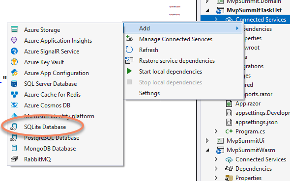
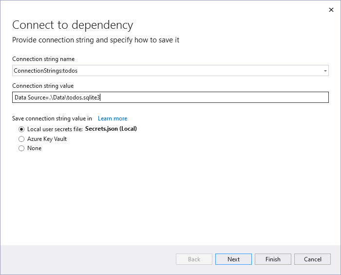
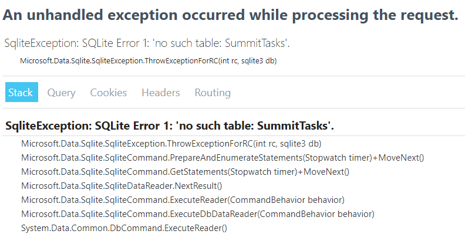
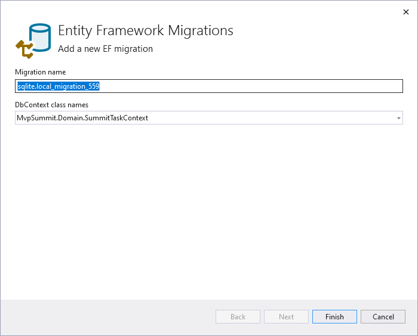
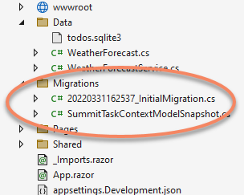
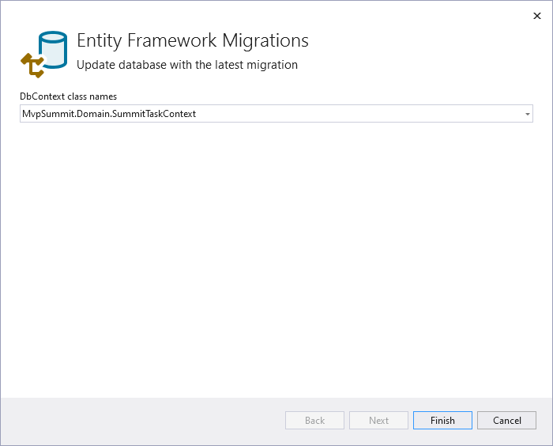

# Step-by-Step: EF Core Migrations in Visual Studio 2022

Starting with [Visual Studio 2022 17.2 Preview 2](https://visualstudio.microsoft.com/vs/preview/), you can work with EF Core migrations straight from the IDE.

🎬[Video: EF Core Migrations in Visual Studio 2022](https://youtu.be/j2XuiWq9Qes)

## Clone the repo

`git clone https://github.com/jeremylikness/MvpSummitTaskList`

## Open Visual Studio 2022

Open the IDE. Set `MvpSummitTaskList` as the startup project and run it. This uses the in-memory service, so when you refresh the page you lose the state.

## Add SQLite via Connected Services

Right-click on the `Connected Services` node and choose **Add**, then **SQLite**.



Give it the name `todos.sqlite3` and use the local secrets file.



Follow the default prompts and it will install the dependencies.

## Wire-up the EF Core DbContext

Open the [Program.cs](https://github.com/JeremyLikness/MvpSummitTaskList/blob/main/MvpSummitTaskList/Program.cs#HL12) and navigate to the service setup. Replace the line that configures `ISummitTaskService` with this:

```csharp
builder.Services.AddScoped<ISummitTaskService, DbSummitTaskService>();
builder.Services.AddScoped<ISummitTaskContextFactory, DefaultSummitContextFactory>();
builder.Services.AddDbContextFactory<SummitTaskContext>(opts =>
opts.UseSqlite("name=todos", b => b.MigrationsAssembly(nameof(MvpSummitTaskList))));

```

1. Swaps to the database service
1. Configures a custom factory (for this project, it is just a passthrough)
1. Configures a factory to generate the [SummitTaskContext](https://github.com/JeremyLikness/MvpSummitTaskList/blob/main/MvpSummit.Domain/SummitTaskContext.cs)
    1. Configures SQLite
    1. Uses the named connection string stored in secrets
    1. Sets the assembly for migrations to be written to

Finally, in preparation for migrations, add the EF Core design package to the `MvpSummitTaskList` Blazor Server project.

```xml
<PackageReference Include="Microsoft.EntityFrameworkCore.Design" Version="6.0.1" />
```

## Run the App

The app is wired to use the database, but when you run it you receive an error because the database isn't configured.



## Add the Migration

Right click on the `Connected Services` node and choose "Manage Connected Services." Click the ellipses next to SQLite and choose "Add migration."



It will take a moment to find the context. You can optionally rename the migration. When it's done, you should see a new migrations folder.



## Update the Database

Using the same ellipses, choose the "Update database" option.



There is only one context, so you should just be able to click "Finish."

## Rerun the Application

Run the application again. This time you should see it working. Add some tasks, mark a few complete, then restart to see the database in action.
