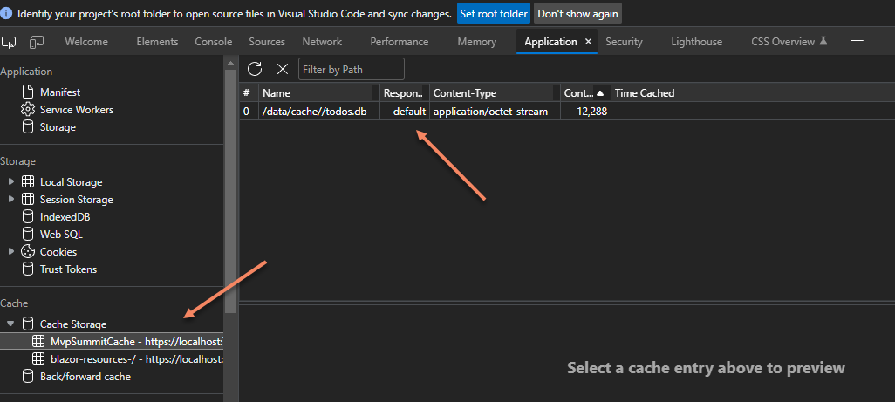
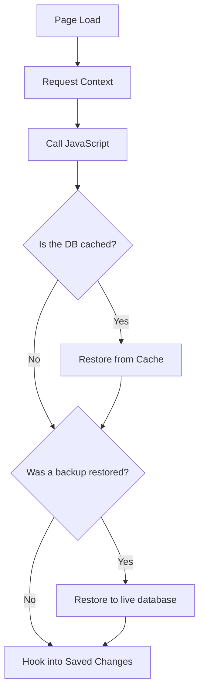

# Step-by-Step: EF Core and SQLite in the Browser with Blazor Wasm

There is support now "out of the box" to add SQLite to your Blazor Wasm projects. There are a few caveats:

1. By default it is stored in memory. This demo shows one way to persist it.
1. Users can clear the client application data at any time, so don't depend on the data being there.
1. As this demo will show, users can easily access the database so it should not be used to store sensitive information.

🎬[Video: EF Core and SQLite in Blazor Wasm](https://youtu.be/2UPiKgHv8YE)

## Clone the repo

`git clone https://github.com/jeremylikness/MvpSummitTaskList`

## Open Visual Studio 2022

Open the IDE. Set `MvpSummitTaskWasm` as the startup project and run it. This uses the in-memory service, so when you refresh the page you lose the state.

## Add Required Packages

Add `Microsoft.EntityFrameworkCore.Sqlite.Core` and `SQLitePCLRaw.bundle_e_sqlite3` to your project.

```xml
<PackageReference Include="Microsoft.EntityFrameworkCore.Sqlite.Core" Version="7.0.0-preview.2.22153.1" />
<PackageReference Include="SQLitePCLRaw.bundle_e_sqlite3" Version="2.1.0-pre20220318192836" />
```
## Update Startup

Open `Program.cs` in the Blazor Wasm project. Add a `using` statement to pull in the data namespace:

```csharp
using MvpSummitWasm.Data;
```

Replace the in-memory service with:

```csharp
builder.Services.AddScoped<ISummitTaskService, DbSummitTaskService>();
builder.Services.AddDbContextFactory<SummitTaskContext>(opts =>
opts.UseSqlite("Data Source=todos.sqlite3"));
builder.Services.AddSynchronizingDataFactory();
```

## Run the Application

The application is ready to run. It will automatically integrate the SQLite WASM assets. The implementation allows you to execute queries and could be useful for caching searches, but the data still goes away when you refresh the page.

## Add Support for Persisted Data

Open the [synchronizing data context factory](https://github.com/JeremyLikness/MvpSummitTaskList/blob/main/MvpSummitWasm/Data/SynchronizedSummitDbContextFactory.cs). Add a `using` to the top:

```csharp
using Microsoft.Data.Sqlite;
```

Uncomment the lines that backup the database by removing the leading `/*` and the closing `*/`. The code is [highlighted here](https://github.com/JeremyLikness/MvpSummitTaskList/blob/main/MvpSummitWasm/Data/SynchronizedSummitDbContextFactory.cs#L88-L97).

## Rerun the Application

Rerun the application. It should now persist data. Add a few tasks, mark some complete, and restart the app to confirm.

## See your Persisted Data

The data is stored in your application cache under a custom path. Open dev tools (`F12` in most browsers) and click on "Application" then "Cache".



You can also download the database to view locally. With the application open, hit F12 and choose "Console." Type the following lines of code and press ENTER after each line (if your port number is different from `7228`, be sure to update it):

```javascript
const cache = await caches.open("MvpSummitCache");
const res = await cache.match('https://localhost:7228/data/cache//todos.db');
const blob = await res.blob();
URL.createObjectURL(blob);
```

You should see something appear in the console like this:

```
'blob:https://localhost:7228/5c4ee88e-6077-4264-b4da-0a0607e3960d'
```

Click on the link and it will download the file. Rename it to have a `.sqlite3` extension and you can open and work with it from any SQLite client!

You can use this same process to generate a file for either the user to click to save the database offline or send it to an API for synchronization.

## How it Works

Everything important is in [SynchronizedSummitDbContextFactory](https://github.com/JeremyLikness/MvpSummitTaskList/blob/main/MvpSummitWasm/Data/SynchronizedSummitDbContextFactory.cs) and [dbSync.js](https://github.com/JeremyLikness/MvpSummitTaskList/blob/main/MvpSummitWasm/wwwroot/dbSync.js).

### General workflow



### Saved Changes

```mermaid
flowchart TD
    A[Backup Database] --> B[Call JavaScript]
    B --> C{Backup Exists?}
    C -- Yes --> D[Push to Cache]
    C -- No --> E[Return]
    D --> E
